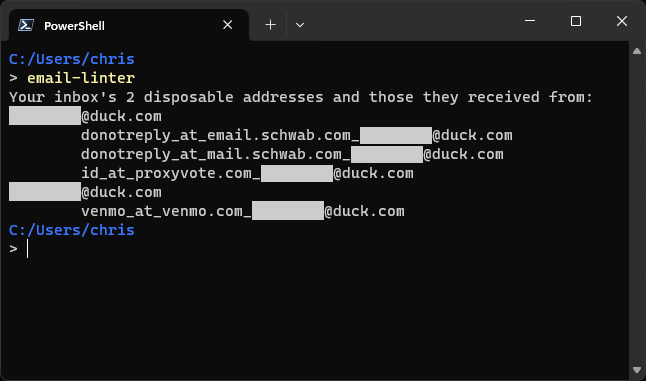

# Email Linter

[](https://pkg.go.dev/github.com/wheelercj/email-linter)

Easily find spam and phishing emails received at [disposable email addresses](#what-are-disposable-email-addresses). This command line app currently works with [Fastmail](https://www.fastmail.com/features/), [Topicbox](https://www.topicbox.com/), and any other email services that have a [JMAP](https://jmap.io/index.html) API. See more examples of these services [here](https://jmap.io/software.html).



Email Linter lists each of your disposable addresses and all the addresses they have received from so you can quickly spot suspicious senders.

## Download

Either:

* run `go install github.com/wheelercj/email-linter@latest` and then `email-linter --help`
* or [download a zipped executable file](https://github.com/wheelercj/email-linter/releases), unzip it, and run the app with `./email-linter --help`

## Privacy

Email Linter communicates with your email service and optionally stores your API token in your device's keyring. No other communication nor storage takes place. There is a chance future versions of Email Linter will store email addresses locally to work more efficiently and offer more features.

## What are disposable email addresses?

They are email addresses created to be used for only one account each. Whenever one of these addresses starts receiving spam or phishing emails, you know exactly which account was compromised and can disconnect the address from your inbox. This way, you immediately stop receiving spam and never have to give your main email address to anyone you don't trust. Some examples of these email protection services are [DuckDuckGo's Email Protection](https://duckduckgo.com/email), [Fastmail's Masked Email](https://www.fastmail.help/hc/en-us/articles/4406536368911-Masked-Email), [Proton's hide-my-email aliases](https://proton.me/pass/aliases), [Firefox Relay](https://relay.firefox.com/), and [iCloud+'s Hide My Email](https://support.apple.com/en-us/105078). Since the emails received by these addresses _should_ have predictable "from" fields, suspicious senders can be easily found with Email Linter. If needed, you can customize which email protection service addresses to search for. Use the `--help` option for more info.

## Why

I got phished. Fortunately, it was a fake phishing email for training against phishing, but I learned to not look at emails while half-asleep and, more importantly, the sender's address was different from normal for the disposable address I used. Email services don't seem to consider that suspicious (at least not yet), and checking the sender's address manually for every email is tedious if you don't remember the correct sender address. Email Linter automates checking sender addresses for you. I hope email services will make it obsolete.

## How does it work?

1. First, Email Linter finds all emails in your inbox that went through an email protection service.
2. Next, it finds all emails outside your spam folder those disposable addresses have ever received.
3. Then it lists each disposable address and the addresses they have received from. This makes it simple to spot suspicious senders so you can easily search your inbox for malicious emails and decide what to do with them.

## API token

Email Linter needs a read-only JMAP API token to securely connect to your account. If you're using Fastmail, you can [create an API token here](https://www.fastmail.com/settings/security/tokens).

Email Linter will ask you to enter the token when you run it, and can optionally save the token in your device's keyring.

## Caveat

Emails with multiple recipients usually don't say which address is yours. Sometimes there are patterns in the recipient addresses that hint at the answer, and Email Linter looks for some of those, but sometimes there are not. This means there's a chance Email Linter could say someone else's address is yours. If this happens to you but you see a pattern in the recipient addresses that could be used to improve the output, please let me know by [creating a new issue](https://github.com/wheelercj/email-linter/issues/new)!

I've considered letting users enter their email addresses, but I doubt anyone who really puts email protection services to good use would want to be constantly updating the list.

**Example:**

When an email is forwarded to a duck address, all the recipient addresses are changed to include the duck address. For example, let's say these are the email's original recipient addresses, and that one of them is yours:

```
alex@hotmail.com
sue@gmail.com
bob@icloud.com
```

If your duck address the email is forwarded to is `a1b2c3@duck.com`, then DuckDuckGo's email protection service will change them to:

```
alex_at_hotmail.com_a1b2c3@duck.com
sue_at_gmail.com_a1b2c3@duck.com
bob_at_icloud.com_a1b2c3@duck.com
```

Since Email Linter can't tell which is yours, its output of recipient addresses includes only the last part, your duck address `a1b2c3@duck.com`.

## Dev resources

Here are some resources that were helpful while creating this app.

* [intro to Go](https://til.chriswheeler.dev/intro-to-go/)
* [Integrating with Fastmail](https://www.fastmail.com/for-developers/integrating-with-fastmail/)
* [Fastmail's JMAP samples](https://github.com/fastmail/JMAP-Samples/tree/main)
* [JMAP Crash Course](https://jmap.io/crash-course.html)
* [the JMAP specs and RFCs](https://jmap.io/spec.html)
* [How and why we built Masked Email with JMAP](https://blog.1password.com/making-masked-email-with-jmap/) by Madeline Hanley at 1Password
* [spf13/cobra](https://github.com/spf13/cobra)
* [GoReleaser](https://goreleaser.com/)
* [GoReleaser Action](https://github.com/marketplace/actions/goreleaser-action)
